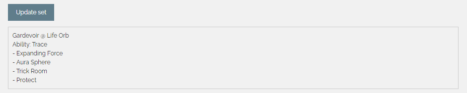
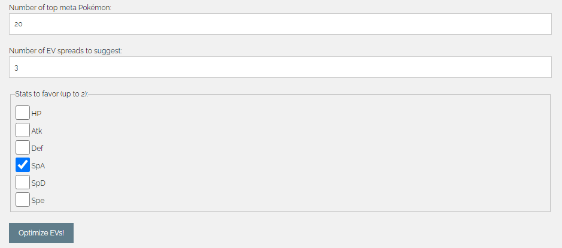

# EV Me

## Overview

EV Me is a Chrome extension for Pokémon Showdown that optimizes effort value (EV) investment for a Pokémon for a specific VGC metagame. The optimizer is configurable, with options such as the number of top meta Pokémon to consider when allocating EVs. This repository contains the native application which must be installed alongside the extension here [FIXME link after extension uploaded]. Extension files are also provided in the [extension](extension) directory.

## Requirements

The following versions were used for development and are compatible with the required dependencies.

* Python 3.6.3
* Node.js 16.13.0
* npm 8.1.0

## Install

Clone this repo:
```
git clone https://github.com/jamesjiang52/EVMe.git
cd EVMe
```

Install dependencies:
```
pip install -r requirements.txt
npm install
npm i -g run-func
```

Run the provided install script to set up the native application:
```
.\install.bat
```

## Usage

EV Me takes as input a Pokémon, its ability and held item, and any number of moves, and outputs a user-specified number of optimized EV spreads. An EV spread is considered to be more optimal if it wastes less EVs, that is, if every single available EV is contributing to a speed benchmark, or an offensive or defensive calc. This is best illustrated using an example (taken from the November 2023, OTS Bo3 VGC metagame at highest Elo bracket).

Consider the following Gardevoir set:


The extension sidebar provides an interface to interact with Pokémon Showdown and the native application. Upon first opening the sidebar, the Pokémon set, options, and suggested EV spreads will be blank.


Clicking "Update set" will import the current Pokémon set info into the extension and convert it into a PokéPaste, shown on the sidebar.



Next, the number of top meta Pokémon to consider and the number of EV spreads to suggest may be adjusted (though the default values are sensible and recommended). Additionally, up to 2 of the Pokémon's stats to favor in the optimizer may be selected. It is *strongly* recommended to select at least one of these. Clicking "Optimize EVs!" will start the native application and run the optimizer. This may take several minutes depending on the speed of the host machine and the number of Pokémon to consider.



Once the native application has finished, the suggested EV spreads will be listed on the sidebar, along with the nature, any remaining unallocated EVs (preferably 0), and the relevant offensive and defensive calcs and speed benchmark for which the EV spread was optimized.


For example, a Gardevoir with the first suggested spread above is extremely likely to survive a Surging Strikes from a common Urshifu-Rapid-Strike, is extremely likely to OHKO a common Amoonguss with Expanding Force, is guaranteed to survive a Flash Cannon from a common Heatran, and is able to outspeed a common Dragonite.

```
28 HP / 0 Atk / 188 Def / 244 SpA / 36 SpD / 12 Spe
Modest Nature
0 Remaining EVs

252+ Atk Unseen Fist Choice Scarf Urshifu-Rapid-Strike Surging Strikes vs. 28 HP / 188 Def Life Orb Trace Gardevoir: 85.7 - 100.0% -- 6.2% chance to OHKO
244+ SpA Life Orb Trace Gardevoir Expanding Force vs. 244 HP / 28 SpD Regenerator Sitrus Berry Amoonguss: 99.1 - 118.2% -- 93.8% chance to OHKO
156+ SpA Flash Fire Leftovers Heatran Flash Cannon vs. 28 HP / 36 SpD Life Orb Trace Gardevoir: 83.0 - 99.3% -- 0.0% chance to OHKO
Outspeed 4 Spe Dragonite
```

Clicking "Use this spread" above a specific EV spread will export the spread to the Showdown teambuilder.


## Uninstall

Run the provided uninstall script:
```
.\uninstall.bat
```

Delete this repo:
```
cd ..
rmdir /s EVMe
```
